 

 

&nbsp;

&nbsp;

&nbsp;

 

  

## 👋 About Me

**Welcome to my digital workspace.**  
I am a Flutter developer from Bangladesh who ships mobile apps, desktop tools, and small automations that make everyday work feel lighter. I care about clean architecture, fast UX, and code that still makes sense six months later.

- 🔭 Building **Flutter apps & plugins** — currently **[ZeroMind](https://github.com/Sajedur0/ZeroMind)** and **[ZeroKit](https://github.com/Sajedur0/ZeroKit)**
- 🌱 Leveling up in **advanced Flutter**, **Python**, and a little **Rust**
- 💡 Drawn to **developer tools**, **Play Store apps**, and **workflow automation**
- 🎯 On a mission to write **clean, efficient, shippable code**
- ⚡ Fun fact: I love turning messy real-world problems into elegant one-click solutions
- 🌐 Portfolio → **[sajedur0.online](https://www.sajedur0.online)**

 

&nbsp;

&nbsp;

 

  

## 🛠️ What I Build

| 📱 Mobile Experiences | 🧰 Developer Tools | 🤖 Automation |
| :---: | :---: | :---: |
| Smooth Flutter apps with Firebase, Play Core updates, and thoughtful UX | One-click SDK installers, project backup, icon pipelines, and utility kits | Python & TypeScript scripts that scrape, clean, and save hours of busywork |
| *Ship it to the store* | *Make the workflow disappear* | *Let the machine do the boring bits* |

  

## 💻 Tech Stack

### Languages

### Frameworks & Platforms

### Tooling

 

`Dart` `Flutter` `Python` `Firebase` `TypeScript` `Rust` `C++` `Git` `Android`

  

## 🚀 Featured Work

 

<b>More repositories</b>

 

| Project | What it is |
| :--- | :--- |
| [**Android-SDK-Installer**](https://github.com/Sajedur0/Android-SDK-Installer) | One-click Android SDK installer |
| [**Payroll-Java**](https://github.com/Sajedur0/Payroll-Java) | Java payroll management system |
| [**Google-Play-Scrapping**](https://github.com/Sajedur0/Google-Play-Scrapping) | Play Store scraper in TypeScript |
| [**Google-Photos-Remover**](https://github.com/Sajedur0/Google-Photos-Remover) | Bulk Google Photos cleaner |
| [**Icon-Converter**](https://github.com/Sajedur0/Icon-Converter) | Icon conversion pipeline in Rust |
| [**Python-Tools**](https://github.com/Sajedur0/Python-Tools) | Personal Python utilities |

  

## 📊 GitHub Analytics

  
  

 

  

 

&nbsp;

&nbsp;

  

## 🏆 Trophies & Highlights

  

 

| Highlight | Why it matters |
| :---: | :--- |
| ⭐ **Starstruck** | Shipped a repo that crossed **25+ stars** |
| 🤝 **Pair Extraordinaire** | Merged a pull request through real pair programming |
| 🚀 **YOLO** | Merged without a review — sometimes you just ship |

  

## 📈 Activity

  

 

### 🐍 Contribution Snake

  <picture>
    <source media="(prefers-color-scheme: dark)" srcset="https://raw.githubusercontent.com/Sajedur0/Sajedur0/main/github-contribution-grid-snake-dark.svg" />
    <source media="(prefers-color-scheme: light)" srcset="https://raw.githubusercontent.com/Sajedur0/Sajedur0/main/github-contribution-grid-snake.svg" />
    
  </picture>

  

## 🌐 Connect

Always happy to talk Flutter, tooling, or a wild product idea. Drop a line.

&nbsp;

&nbsp;

&nbsp;

&nbsp;

&nbsp;

  

&nbsp;&nbsp;

&nbsp;&nbsp;

&nbsp;&nbsp;

&nbsp;&nbsp;

 

 

